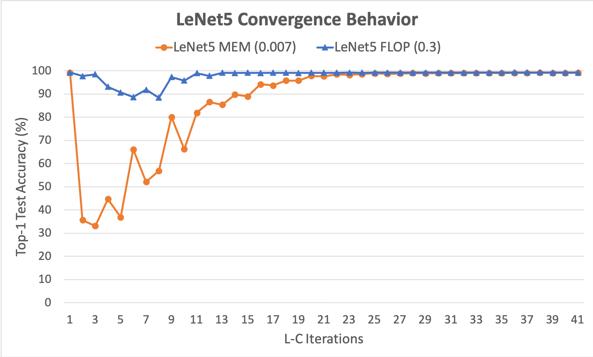

# Tutorial: LeNet-5 Compression

In this tutorial, we will walk through compressing the LeNet-5 neural network using Condensa for two different objectives: reducing total model memory footprint, and reducing the inference latency of the compressed model. 

We assume that Condensa is already installed and working (check out the [Installation Guide](https://nvlabs.github.io/condensa/guide/install.html) for instructions). If you'd like to follow along by executing the code in this notebook, please also make sure that [Jupyter](https://jupyter.org/) is installed on your local system.

## Defining the Network

Let's start by defining the LeNet5 network architecture in PyTorch as shown below:


```python
import torch
import torch.nn as nn

class LeNet5(nn.Module):
  def __init__(self):
    super(LeNet5, self).__init__()
    self.conv1 = nn.Conv2d(1, 20, kernel_size=5, stride=1)
    self.relu_conv1 = nn.ReLU(inplace=True)
    self.pool1 = nn.MaxPool2d(kernel_size=2, stride=2)
    self.conv2 = nn.Conv2d(20, 50, kernel_size=5, stride=1)
    self.relu_conv2 = nn.ReLU(inplace=True)
    self.pool2 = nn.MaxPool2d(kernel_size=2, stride=2)

    self.ip1 = nn.Linear(50*4*4, 500)
    self.relu_ip1 = nn.ReLU(inplace=True)
    self.ip2 = nn.Linear(500, 10)

  def forward(self, x):
    x = self.conv1(x)
    x = self.relu_conv1(x)
    x = self.pool1(x)
    x = self.conv2(x)
    x = self.relu_conv2(x)
    x = self.pool2(x)

    x = x.view(x.size(0), -1)

    x = self.ip1(x)
    x = self.relu_ip1(x)
    x = self.ip2(x)
    return x
```


```python
model = LeNet5()
```

## Load Pre-Trained Weights

Now that we have defined the network architecture, let us load a pre-trained set of weights into the model from the `LeNet5.pth` file included with this notebook. In case you would like to train your own LeNet5 network, you may alternatively use the `/workspace/condensa/examples/mnist/train.py` script in the container.


```python
model.load_state_dict(torch.load('LeNet5.pth'))
```

## Preparing for Compression

Let's make sure CUDA is enabled in PyTorch.


```python
assert torch.cuda.is_available()
```

Define training, test, and validation sets.


```python
import torch.optim as optim
import torch.utils.data as data
from torchvision import datasets, transforms
from torch.autograd import Variable
```


```python
trainset = datasets.MNIST('data', train=True, download=True,
                          transform=transforms.Compose([
                          transforms.ToTensor(),
                          transforms.Normalize((0.1307,), (0.3081,))]))
testset  = datasets.MNIST('data', train=False, transform=transforms.Compose([
                          transforms.ToTensor(),
                          transforms.Normalize((0.1307,), (0.3081,))]))

# Split training set into training and validation sets
trainsize,valsize = 54000,6000
trainset,valset = data.random_split(trainset, [trainsize, valsize])
```

Here, we randomly split the training set consisting of 60,000 samples into _training_ and _validation_ sets of sizes 54,000 and 6,000 respectively. Next, let us define the loss criterion to use (softmax cross-entropy).


```python
criterion = nn.CrossEntropyLoss().cuda()
```

Finally, we set our logging level to `INFO` so that Condensa prints out intermediate updates.


```python
import logging
logging.basicConfig(level=logging.INFO, format='%(message)s')
```

## Two Different Compression Strategies

In this tutorial, we will explore two different ways of compressing the LeNet5 network: one targeted at reducing the total model memory footprint (named `MEM`) and the other at reducing inference runtime latency (named `FLOP`).

### MEM Scheme

The `MEM` scheme aims to reduce the total model memory footprint (number of bytes required to store the non-zero elements of the compressed model). To this end, we perform a combination of _pruning_ (clipping model parameters to zero) and _quantization_ (using 16-bit floating point representation to store model weights instead of 32-bit). Expressing this scheme in Condensa is fairly straightforward using the built-in [`Compose`](https://nvlabs.github.io/condensa/modules/schemes.html#composition) scheme as shown below:


```python
import condensa
from condensa.schemes import Compose, Prune, Quantize

MEM = Compose([Prune(0.007), Quantize(condensa.float16)])
```

Here, the [`Compose`](https://nvlabs.github.io/condensa/modules/schemes.html#composition) operator successively applies pruning followed by quantization to the model. The pruning density, or the ratio of non-zero parameters in the compressed model to the original one, is specified as 0.007 (0.7%). Condensa includes a number of other common schemes, including structured and block pruning, among others. For a list of available schemes, please refer to [this page](https://nvlabs.github.io/condensa/modules/schemes.html) in the API documentation. Users may also define their own custom schemes as Python functions that invoke the compression and decompression operators available in Condensa (see the `/workspace/condensa/condensa/schemes.py` file in the container for examples of how to define custom schemes).

### FLOP Scheme

While the `MEM` scheme is effective at reducing the number of non-zero elements in a model, this may not directly translate into improvements in actual inference runtime. Most modern CPUs and GPUs are unable to detect individual zero elements and bypass computations on them in hardware. Instead, to realize speedups on such architectures, we perform structured pruning, which removes entire blocks of non-zeros at once in the form of neurons (1-D blocks) and/or filters (3-D blocks). This enables the weight tensors to be physically reshaped in the compressed model. We call this the `FLOP` scheme in this tutorial, and use the [`StructurePrune`](https://nvlabs.github.io/condensa/modules/schemes.html#structured-pruning) scheme in Condensa to define it.


```python
from condensa.schemes import StructurePrune
FLOP = condensa.schemes.StructurePrune(0.3)
```

Since LeNet5 contains a significant number of parameters in its fully-connected layers, we utilize the [`StructurePrune`](https://nvlabs.github.io/condensa/modules/schemes.html#structured-pruning) scheme as shown above, which prunes neurons and filters from fully-connected and convolutional layers, respectively. For networks with a relatively small number of parameters in fully-connected layers, it is typically sufficient to perform filter pruning alone.

## Setting up the Optimizer

To recover any accuracy lost due to compression, Condensa comes with a set of _optimizers_. Each optimizer takes a pre-trained model, applies the compression scheme, and tries to recover the original accuracy either directly or iteratively. In this tutorial, we'll be using Condensa's L-C optimizer. We instantiate it as follows:


```python
lc = condensa.opt.LC(steps=2,                          # L-C iterations
                     l_batch_size=512,                  # L-step batch size
                     lr=0.02,                           # Initial learning rate
                     lr_decay=0.98,                     # Learning rate decay 
                     momentum=0.95,                     # SGD momentum               
                     sgd_iterations_per_l=2000,         # SGD iterations per L-step
                     sgd_iterations_first_l=10000,      # SGD iterations for first L-step
                     mu_init=9.765625e-05,              # Initial value of `mu`
                     mu_multiplier=1.1,                 # Multiplier for `mu`
                     mu_cap=10000,                      # Maximum value of `mu`
                     val_batch_size=100)                # Validation and test batch size
```

Each optimizer in Condensa has its own set of hyper-parameters which must be specified manually by the user. A full description of hyper-parameter tuning is beyond the scope of this tutorial, but for additional information on what each hyper-parameter represents and tips on finding its optimal value, we refer you to the Condensa paper. In our case, we run the L-C algorithm for 40 iterations using the hyper-parameter values shown above. LC hyper-parameter values for a number of common convolutional neural networks are also included in the `/workspace/condensa/examples` folder in the container.

## Compressing the Model

Once the optimizer is instantiated, we can go ahead and perform the actual compression using the [`Compressor`](https://nvlabs.github.io/condensa/modules/compressor.html#model-compressor) class and its [`run`](https://nvlabs.github.io/condensa/modules/compressor.html#condensa.compressor.Compressor.run) method:


```python
compressor_MEM  = condensa.Compressor(lc,
                                      MEM,
                                      model,
                                      trainset,
                                      testset,
                                      valset,
                                      criterion)
w_MEM  = compressor_MEM.run()
```


```python
compressor_FLOP = condensa.Compressor(lc,
                                      FLOP,
                                      model,
                                      trainset,
                                      testset,
                                      valset,
                                      criterion)

w_FLOP = compressor_FLOP.run()
```

We specify the optimizer, scheme, input model, training, test, and validation sets, and the loss criterion to create an instance of the [`Compressor`](https://nvlabs.github.io/condensa/modules/compressor.html#model-compressor) class. Since the optimizer is specified as a parameter, we are able to easily experiment with alternative optimizers in Condensa.

In the above snippets, `w_MEM` and `w_FLOP` contain the models compressed using the `MEM` and `FLOP` schemes, respectively. We can now save these to disk:


```python
torch.save(w_MEM.state_dict(), 'w_mem.pth')
torch.save(w_FLOP.state_dict(), 'w_flop.pth')
```

Condensa also records various statistics about the compression process. These can be retrieved using the `statistics` member of the compressor object as follows:


```python
for k,v in compressor_MEM.statistics.items():
    print('{}: {}'.format(k, v))
```


```python
for k,v in compressor_FLOP.statistics.items():
    print('{}: {}'.format(k, v))
```

## Results

### Convergence and Accuracy

The following chart depicts the convergence pattern of the L-C optimizer for both the schemes. Here, the x-axis represents L-C iterations, while the y-axis shows the top-1 test accuracy.



We notice that L-C achieves within 0.15% test accuracy of the baseline model for both schemes in under 40 iterations.

### Memory and Runtime Reductions

Using the `MEM` scheme, we reduce the model memory footprint by **239x**. Additionally, we achieve a **2.17x** improvement in inference latency on a Titan V GPU using the `FLOP` scheme. Note that realizing inference speedups involves physically reshaping the compressed tensors, a process we refer to as _network thinning_. Thinning support in Condensa is currently experimental, and we will be updating this notebook with instructions on how to perform thinning once support for it is fully integrated into Condensa.

## More Info

We provide additional real-world compression examples targeting complex networks such as ResNet50 and VGG-19 in Condensa's examples folder (`/workspace/condensa/examples` in the container). Be sure to check them out!

For more details on the design and implementation of Condensa, and its performance on real-world networks, please refer to the Condensa paper.
